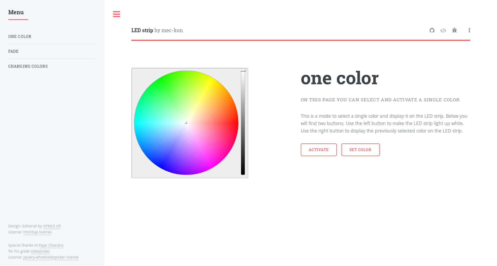

# led-strip-server
### This is a simple server program for a Raspberry Pi that hosts a web page to select different colors on it.
### These colors are then displayed on an RGB led strip.



Demo
--------

Try out a demo <a href="https://mec-kon.github.io/led-strip-website/src/" target="_blank">here</a>

Modes
--------

Three different modes are currently available.
* The one color mode allows you to select a simple color.
* The fade mode can be used to select several colors between which the color 
of the LED strip moves.
* The changing colors mode switches between all selected colors.

## Installation: ## 
The easiest way to install the program is with CMake.  

First you need to install all required dependencies.
You can do this with ```sudo apt-get install cmake wiringpi build-essential```.

Then, all you have to do is create a new folder with ```mkdir build``` in the current project folder, change to this folder with ```cd build``` and create a makefile  
with ```cmake .. -DCMAKE_BUILD_TYPE=Debug``` .  
Then you can create the executables by simply typing ```make```  
Now install the server with ```make install```.

### Autostart ###

To start the server automatically when booting, you can use crontab.
But first you have to activate the automatic login.
For this you have to open the settings with ```sudo raspi-config```.

Navigate to "Boot Options" and then to "Desktop/CLI".
Select "Console Autologin" and then "Finish".

Restart the Raspberry Pi.

Next type ```crontab -e```.
In the window that opens, add the line "@reboot /usr/local/bin/led-strip-server".

Pull requests
--------

Pull requests are always welcome !